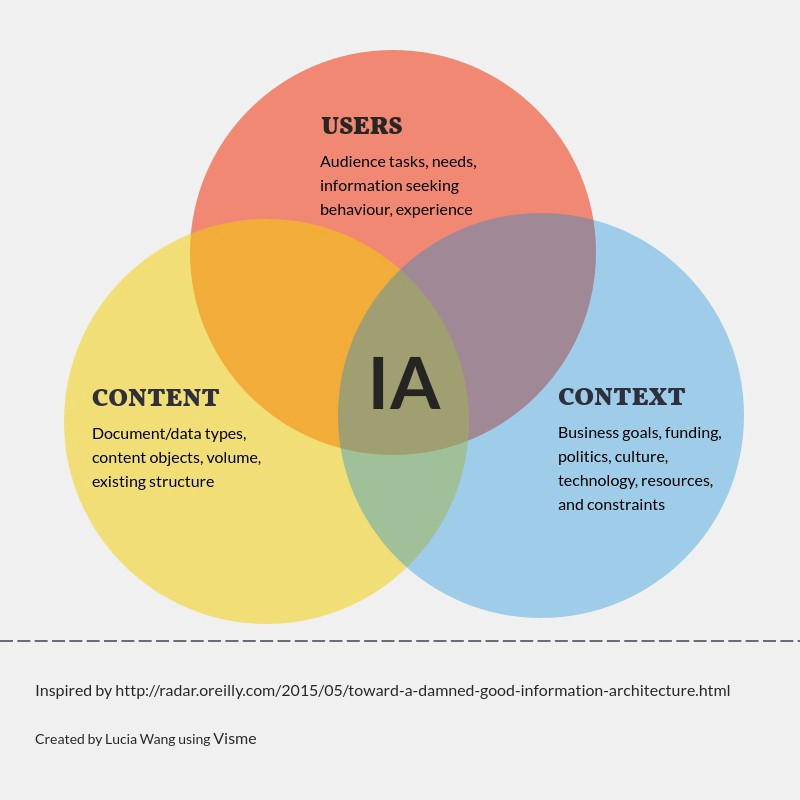

# Information Architecture (IA)

## Apa itu Information Architecture

**Information Architecture** adalah Ilmu yang yang menyusun konten pada website, aplikasi mobile, media sosial, dll. IA bertujuan untuk mengatur konten sehingga pengguna akan lebih mudah untuk memahami sebuah informasi tanpa membutuhkan usaha yang besar. konten yang tidak terorganisir dengan baik membuat navigasi menjadi sulit dan tidak jelas sehingga dapat membuat pengguna tersesat dan merasa terganggu saat melakukan sebuah tugas. namun IA yang kuat akan menjamin produk yang berkualitas tinggi karena dapat mengurangi masalah informasi dan navigasi.

## Macam-Macam Komponen Utama Pada AI

- **Organization systems**
- **labeling systems**
- **navigation systems**
- **searching systems**

### Referensi 
- [Information Architecture. Basics for Designers](https://uxplanet.org/information-architecture-basics-for-designers-b5d43df62e20)