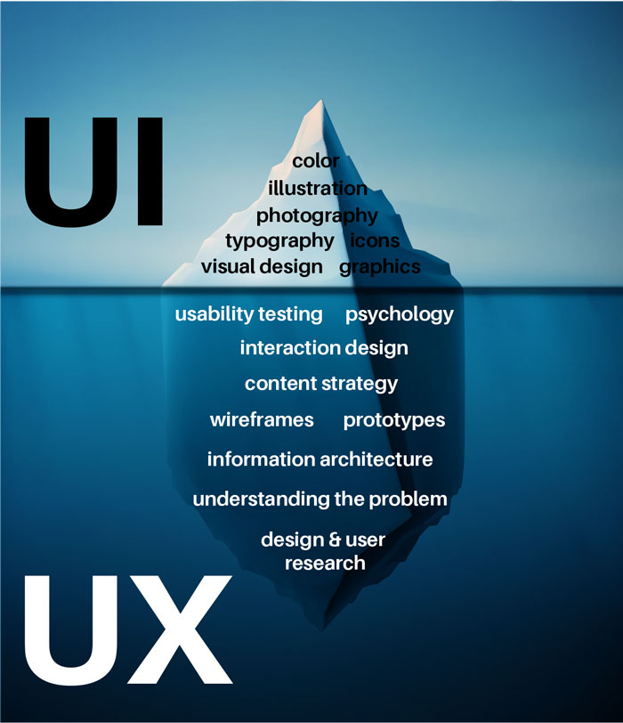
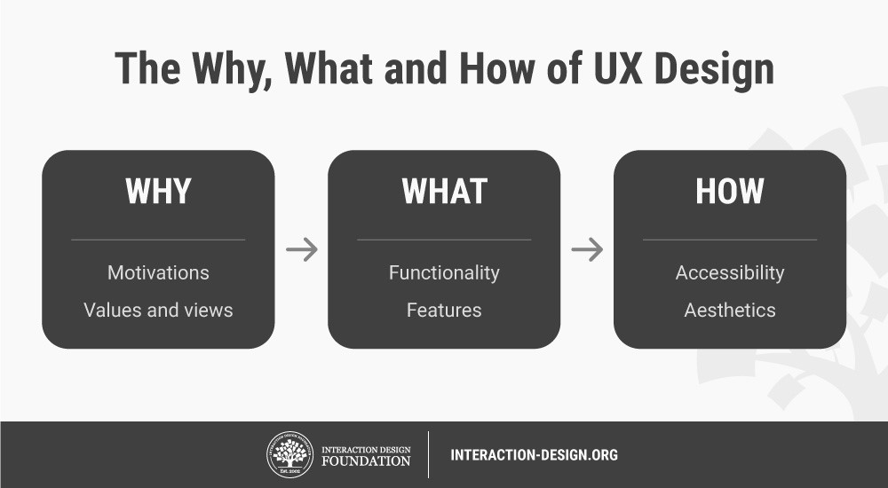

# Pengenalan UX Design

## 1. Apa Itu UX Design

**UX Design** adalah sebuah proses yang digunakan oleh tim desain untuk membangun sebuah produk yang dapat memberikan pengalaman yang bermakna dan relevan bagi pengguna.

sebenarnya **UX Design** hampir mirip dengan **UI Design** namun yang membedakan adalah UX Design lebih memfokuskan kepada pengguna sedangkan UI Design lebih mengutamakan segi estetika dari sebuah tampilan. setiap komponen yang ada pada design tersebut semuanya memilik sebuah alasan tersendiri.

## 2. UX Design Produk

UX Design harus mempertimbangkan **Apa**, **Mengapa**, **Bagaimana**, design ux harus dapat menjawab pertanyaan-pertnayaan seperti dibawah ini :  

1. Apakah halaman ini berhubungan dengan tugas yang sedang mereka kerjakan?
2. Mengapa tombol submit berwarna hijau?
3. Bagaimana pengguna dapat melakukan proses penginputan data dengan mudah? 

Dalam desain pengalaman pengguna kita harus dapat memastikan "Substansi" dari produk yang kita buat sesuai dengan target pengguna kita sehingga dapat menghasilkan sebuah produk yang baik.