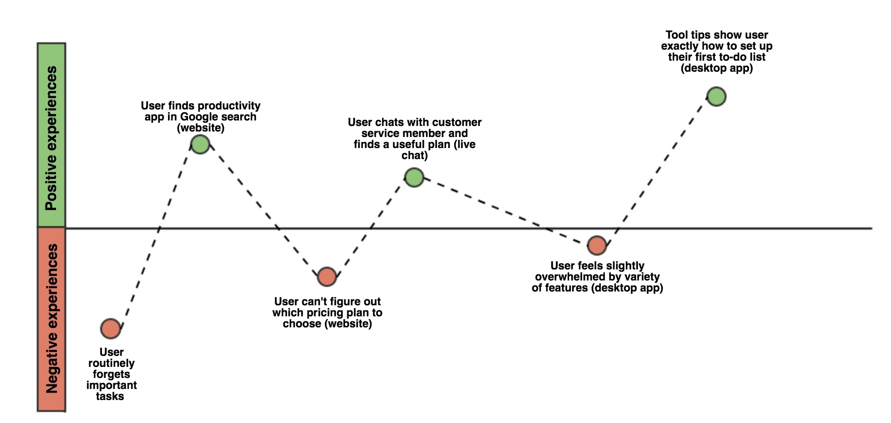

# User Journey

## Apa itu user journey

**User Journey** adalah sebuah ilustrasi dari perjalanan pengguna dengan perusahaan, brand dan layanan yang disedikan. dimulai ketika seorang pengguna memutuskan untuk membeli atau menggunakan produk maupun layanan yang ditawarkan. user journey dapat memvisualisasikan bagaimana pengguna berinteraksi dengan suatu produk dan memungkinkan perancang untuk melihat suatu produk dari sudut pandang pengguna.

## Langkah-langkah untuk membuat user journey

 1. Menetapkan ruang lingkup
 2. Menetapkan target pengguna (persona)
 3. Menentukan skenario dan harapan pengguna
 4. Membuat daftar ***touchpoint*** (setiap pelanggan melakukan kontak langsung dengan produk)
 5. Membuat daftar motivasi pengguna saat menggunakan porduk
 6. Membuat sketsa perjalanan pengguna
 7. Menentukan emosi pengguna pada setiap langkah
 8. Melakukan pengujian terhadap pengguna

 ### Referensi
 - [Pengenalan User Journey](https://id.techinasia.com/mengapa-customer-journey-mapping-penting)
 - [A Beginner’s Guide To User Journey Mapping](https://uxplanet.org/a-beginners-guide-to-user-journey-mapping-bd914f4c517c)

  